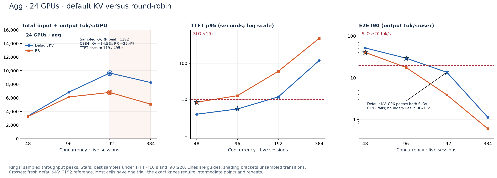
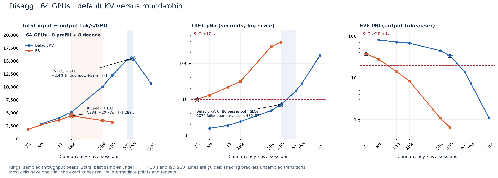

# KV-aware vs. round-robin routing: NVIDIA Dynamo on Google Cloud

Coding agents resend long conversation prefixes as they edit code, call tools,
and spawn subagents. This Google Cloud CUJ follows that request through Dynamo's
router and serving workers to compare how KV-aware (KV) and round-robin (RR)
routing affect throughput, time to first token, and end-to-end responsiveness.

This comparison packages the **Nemotron-3-Ultra-550B-A55B-NVFP4** experiments as
separate aggregated (agg) and disaggregated (disagg) recipes for **A4X Max / GB300
on GKE**. The measured results below are a September 20, 2026 snapshot; these
portable scripts have been checked offline and still need a GKE smoke run.

- [Configurations](#configurations)
- [Dataset and replay methodology](#dataset-and-replay-methodology)
- [Prerequisites](#prerequisites)
- [Quickstart](#quickstart)
- [Sweeps and artifacts](#sweeps-and-artifacts)
- [Measured performance](#measured-performance)
- [Cleanup](#cleanup)

## Configurations

The architecture-specific files live in separate N3U directories:

```text
inference/a4xmax/
├── aggregated-serving/dynamo/sglang/n3u-kv-vs-rr/
│   ├── README.md
│   ├── recipe.json
│   ├── deploy.sh
│   └── sweep.sh
└── disaggregated-serving/dynamo/sglang/
    ├── README.md                 # This comparison and shared setup guide
    └── n3u-kv-vs-rr/
        ├── README.md
        ├── recipe.json
        ├── deploy.sh
        ├── sweep.sh
        ├── env.example.sh
        ├── containers/
        ├── scripts/              # Shared deployment and sweep helpers
        ├── tests/
        └── results/              # Measured curves, CSV, and provenance
```

Keep the repository checkout intact: both entry points use the shared helpers
under the disaggregated N3U directory. The quickstart defines paths for both
recipes and uses that directory as the image-build and artifact working directory.

| Setting | Agg | Disagg (D88) |
| --- | --- | --- |
| Recipe | [Agg recipe](../../../aggregated-serving/dynamo/sglang/n3u-kv-vs-rr/recipe.json) | [Disagg recipe](n3u-kv-vs-rr/recipe.json) |
| Entry points | [deploy.sh](../../../aggregated-serving/dynamo/sglang/n3u-kv-vs-rr/deploy.sh), [sweep.sh](../../../aggregated-serving/dynamo/sglang/n3u-kv-vs-rr/sweep.sh) | [deploy.sh](n3u-kv-vs-rr/deploy.sh), [sweep.sh](n3u-kv-vs-rr/sweep.sh) |
| GPUs / nodes | 24 / 6 | 64 / 16 in one NVLink domain |
| Workers | 6 combined prefill/decode | 8 prefill + 8 decode |
| Parallelism per worker | TP4, EP4 | TP4, EP4 on both stages |
| Quantization | `modelopt_fp4` | `modelopt_fp4` |
| Context / KV page | 262,144 / 64 tokens | 262,144 / 64 tokens |
| Max running requests per worker | 16 | Prefill 8; decode **64** |
| Prefill chunk / static memory fraction | 16,384 / 0.85 | 16,384 on prefill / 0.85 on both stages |
| Discovery / request plane | etcd / NATS | etcd / NATS |
| Transfer / resource claim | No P→D transfer; measured mRDMA claim retained | Mooncake MNNVL; ComputeDomain/IMEX channel |
| Speculative decoding | Disabled | Disabled |
| Runtime package pins | Dynamo 1.4.2, SGLang 0.5.16, FlashInfer 0.6.18 | Same |

The JSON files contain worker arguments and environment settings. They are
inputs to the component scripts, **not Kubernetes manifests**. Deployment uses
individual `kubectl create`, `patch`, `scale`, and `expose` commands. A
ComputeDomain and an RDMA ResourceClaimTemplate each need their own structured
Kubernetes API request; their creation is a separate step.

For both architectures, RR is `--router-mode round-robin`. Default KV is
`--router-mode kv --router-temperature 0 --router-queue-policy fcfs`.
**Prefix caching stays enabled for both policies.** KV events are enabled on
the workers. No session-affinity TTL or speculative-decoding setting is added
to the baseline.

The [serving image build](n3u-kv-vs-rr/containers/serving.Dockerfile) starts from the same
SGLang base tag as the experiments, installs the pinned runtime packages at
build time, and checks their versions. The old base tag `v0.5.19` was followed
by an installation of SGLang **0.5.16**; it was not the final version. Both new
images must be addressed by digest when deploying. The new recipes also enable
engine metrics/cache reporting, use dedicated CPU clients, pin model/tokenizer
revisions, and reset workers before each point by default. Those improvements
mean a new run is not an exact reproduction of every historical setup detail.

## Dataset and replay methodology

Use AIPerf **0.12.0** with `--scenario inferencex-agentx-mvp` and the date-pinned
alias `semianalysis_cc_traces_weka_062126_256k`, backed by the
[Weka 256K corpus](https://huggingface.co/datasets/semianalysisai/cc-traces-weka-062126-256k).
It contains **393 coding-session roots**, including their subagent trees. The
256K corpus drops over-length requests; it is a different workload from the
full-context corpus. It matches the **262,144-token serving configuration**
used here, not a claim about the model's maximum supported context.

AIPerf reconstructs prompts with the model tokenizer, preserves recorded turn
delays and subagent dependencies, and measures the cache reuse that results.
We do not configure a target cache-hit percentage. **Concurrency counts live
session trees**, not simultaneous HTTP requests or a decode batch size. See
the [upstream AgentX replay guide](https://github.com/ai-dynamo/aiperf/blob/v0.12.0/docs/tutorials/agentx-mvp.md)
for the scenario implementation.

| Replay control | Recipe value |
| --- | --- |
| Seed / corpus size | 42 / 393 roots |
| Initial trajectory window | 0.25–0.75, matching this experiment; upstream defaults differ |
| Warmup | Scenario trajectory warmup, outside profiling; no extra synthetic warmup |
| Timing | Recorded end-to-start delays; whole-system idle-gap cap 10 s |
| Profiling / grace | 3,600 s / 60 s per point |
| Request timeout | 1,200 s; a deep cold prefill can require a larger value |
| Output | Streaming, `ignore_eos`, server token counts |
| Recycling | New `first_turn_prefix` cache-bust marker for each play |
| Client | `--workers-max 200 --record-processors 8`; configurable in `env.sh` |

Use the same corpus, tokenizer revision, duration, seed, hardware, and worker
configuration across A/B arms. The scripts alternate KV/RR at each concurrency
and reverse the order on even-numbered repeats. Worker restart before each
cell gives a defined cold starting state; trajectory warmup then primes it.
The historical campaign did not flush every cell. `--cache-reset reuse` is
available for studying that behavior; label it and do not mix reset policies
within a comparison.

A completed Job counts only after AIPerf exits successfully and records
`metadata.submission_valid: true`. A smoke run retains the scenario and passes
`--unsafe-override`, so it must be marked **invalid** and is excluded from
comparisons. The stamp covers replay rules, not full InferenceX submission
compliance, model accuracy, or equivalence to another serving recipe.

## Prerequisites

1. A GKE Standard cluster with `a4x-maxgpu-4g-metal` nodes, working GPU drivers
   and CUDA 13 support. Reserve six GPU nodes for agg or sixteen for D88;
   running both simultaneously takes **88 GPUs**. D88's sixteen nodes must
   share one NVLink domain. A node-pool name alone does not prove that topology.
2. Working NVIDIA ComputeDomain/DRA and IMEX for D88. For the agg recipe,
   configure [GKE managed DRANET](https://docs.cloud.google.com/kubernetes-engine/docs/how-to/allocate-network-resources-dra)
   and A4X Max's `asapd-lite` so `mrdma.google.com` can allocate eight NICs per
   worker. The recipe uses the `resource.k8s.io/v1` claim API; verify support
   before creating the claim. Do not silently fall back to TCP for a D88 result.
3. `gcloud`, the GKE auth plugin, `kubectl`, Python 3.10+, Docker Buildx, and
   permission to create namespace-scoped workloads/claims. Deployment scripts
   use explicit `--context` and `--namespace`; they do not change your context.
4. A separate CPU node pool for the load generator. One benchmark Job requests
   **32 CPUs and 128 GiB**, plus a small helper Pod (1 CPU / 2 GiB). Start with
   that capacity and check CPU, memory, file descriptors, and client warnings
   before increasing concurrency. `workers-max` is a process cap, not a CPU
   reservation. Provision more client capacity if the client cannot keep up.
5. An accessible model checkpoint and its tokenizer, plus accepted download
   terms as needed. The quickstart uses the
   [NVIDIA checkpoint](https://huggingface.co/nvidia/NVIDIA-Nemotron-3-Ultra-550B-A55B-NVFP4).
   The measured jobs used a staged `alisachen/...` checkpoint whose immutable
   revision was not captured; bit-for-bit equivalence is not established.
6. A model PVC readable by all serving Pods, and a separate writable artifact
   PVC with sufficient space for full JSONL exports and the reconstruction
   cache. Use RWX storage for artifacts (for example a configured Filestore
   StorageClass); a single-node RWO disk can block the helper and Job placement.
   For Cloud Storage model volumes, enable the GCS Fuse CSI driver and Workload
   Identity using the [GKE setup guide](https://docs.cloud.google.com/kubernetes-engine/docs/how-to/cloud-storage-fuse-csi-driver-setup).
7. Reachable etcd and NATS services. This experiment deliberately retains its
   etcd/NATS discovery and request path. It uses plain Kubernetes Deployments,
   so it does not require a DynamoGraphDeployment operator. For a broader
   operator installation, use the [existing a4xmax guide](../README.md)
   and [NVIDIA installation guide](https://docs.nvidia.com/dynamo/dev/kubernetes/installation/install-dynamo).

## Quickstart

Run the following on your administration machine. Commands deploy onto the
cluster only when you execute them. The full ladders take hours; start with
the smoke run, then one measured concurrency.

### 1. Configure the project, cluster, and images

```bash
git clone https://github.com/alisachen-google/gpu-recipes.git
cd gpu-recipes/inference/a4xmax
export A4XMAX_ROOT=$PWD
export AGG_RECIPE_ROOT=$A4XMAX_ROOT/aggregated-serving/dynamo/sglang/n3u-kv-vs-rr
export DISAGG_RECIPE_ROOT=$A4XMAX_ROOT/disaggregated-serving/dynamo/sglang/n3u-kv-vs-rr
cd "$DISAGG_RECIPE_ROOT"
cp env.example.sh env.sh
# Edit env.sh: project, pools, storage, image digests, and model/tokenizer SHAs.
source env.sh
gcloud container clusters get-credentials "$CLUSTER_NAME" \
  --project "$PROJECT_ID" --region "$CLUSTER_REGION"
kubectl --context "$KUBE_CONTEXT" get nodes -L cloud.google.com/gke-nodepool
kubectl --context "$KUBE_CONTEXT" get deviceclasses
kubectl --context "$KUBE_CONTEXT" api-resources --api-group=resource.nvidia.com
```

Build the serving image on ARM64 or a builder supporting ARM64. Build the
client image for `CPU_ARCH` (`amd64` or `arm64`). Use an existing Artifact
Registry Docker repository; the cluster nodes need pull access. Set `REGISTRY`
to its full path, such as `REGION-docker.pkg.dev/PROJECT/REPOSITORY`.

```bash
export REGISTRY=YOUR_ARTIFACT_REGISTRY_PATH
gcloud auth configure-docker "${REGISTRY%%/*}"
# Inspect the base image, then use its ARM64-capable manifest digest below.
docker buildx imagetools inspect lmsysorg/sglang:v0.5.19-cu130-runtime
export SGLANG_BASE_IMAGE=lmsysorg/sglang@sha256:YOUR_BASE_DIGEST
docker buildx build --platform linux/arm64 \
  --build-arg SGLANG_BASE_IMAGE="$SGLANG_BASE_IMAGE" \
  -f containers/serving.Dockerfile -t "$REGISTRY/agentx-serving:1.4.2" --push .
docker buildx build --platform "linux/$CPU_ARCH" \
  -f containers/client.Dockerfile -t "$REGISTRY/agentx-client:0.12.0" --push .
docker buildx imagetools inspect "$REGISTRY/agentx-serving:1.4.2"
docker buildx imagetools inspect "$REGISTRY/agentx-client:0.12.0"
# Put the returned image digests into SERVING_IMAGE and CLIENT_IMAGE in env.sh.
source env.sh
```

### 2. Create the namespace, identity, and storage

```bash
kubectl --context "$KUBE_CONTEXT" create namespace "$NAMESPACE"
kubectl --context "$KUBE_CONTEXT" -n "$NAMESPACE" create serviceaccount "$SERVICE_ACCOUNT"
# Optional for public downloads; keep HF_SECRET empty in env.sh if unused.
read -rs -p 'Hugging Face token: ' HF_TOKEN
kubectl --context "$KUBE_CONTEXT" -n "$NAMESPACE" create secret generic "$HF_SECRET" \
  --from-literal=HF_TOKEN="$HF_TOKEN"
unset HF_TOKEN
```

Provision the model PVC using the linked GCS Fuse guide or your existing RWX
storage. Give `SERVICE_ACCOUNT` read access to the model bucket with Workload
Identity. Stage the **pinned** model into the path exposed as `MODEL_PATH`.
For example, on a host with enough disk space and the Hugging Face CLI:

```bash
# Resolve once, record these three values in env.sh, and use them for both arms.
export MODEL_REVISION=$(git ls-remote "https://huggingface.co/$MODEL_ID" HEAD | awk '{print $1}')
export TOKENIZER_REVISION=$MODEL_REVISION
export MODEL_PATH=/model-cache/nemotron/$MODEL_REVISION
hf download "$MODEL_ID" --revision "$MODEL_REVISION" --local-dir ./staged-model
gcloud storage rsync --recursive ./staged-model \
  "gs://YOUR_MODEL_BUCKET/nemotron/$MODEL_REVISION"
```

Create a separate artifact claim, specifying your installed **RWX** class.
This is one storage API request, not a combined serving deployment:

```bash
export ARTIFACT_STORAGE_CLASS=YOUR_RWX_STORAGE_CLASS
kubectl --context "$KUBE_CONTEXT" -n "$NAMESPACE" create -f - <<EOF
{"apiVersion":"v1","kind":"PersistentVolumeClaim",
 "metadata":{"name":"$ARTIFACT_PVC"},
 "spec":{"accessModes":["ReadWriteMany"],"storageClassName":"$ARTIFACT_STORAGE_CLASS",
         "resources":{"requests":{"storage":"1Ti"}}}}
EOF
kubectl --context "$KUBE_CONTEXT" -n "$NAMESPACE" get pvc "$MODEL_PVC" "$ARTIFACT_PVC"
```

### 3. Start the discovery and request services

Skip creating these resources if you set `ETCD_ENDPOINTS` and `NATS_SERVER`
to suitable existing services. These single-replica services are for an
isolated benchmark namespace; keep them off the GPU nodes.

```bash
kubectl --context "$KUBE_CONTEXT" -n "$NAMESPACE" create deployment agentx-etcd \
  --image=quay.io/coreos/etcd:v3.5.21 --replicas=0 -- \
  /usr/local/bin/etcd --listen-client-urls=http://0.0.0.0:2379 \
  --advertise-client-urls=http://agentx-etcd:2379 --data-dir=/tmp/etcd
kubectl --context "$KUBE_CONTEXT" -n "$NAMESPACE" patch deployment agentx-etcd --type=merge \
  -p "{\"spec\":{\"template\":{\"spec\":{\"nodeSelector\":{\"cloud.google.com/gke-nodepool\":\"$CPU_NODEPOOL\"}}}}}"
kubectl --context "$KUBE_CONTEXT" -n "$NAMESPACE" scale deployment/agentx-etcd --replicas=1
kubectl --context "$KUBE_CONTEXT" -n "$NAMESPACE" expose deployment agentx-etcd --port=2379
kubectl --context "$KUBE_CONTEXT" -n "$NAMESPACE" create deployment agentx-nats \
  --image=nats:2.11.6-alpine --replicas=0 -- /bin/sh -c '
cat > /tmp/nats.conf <<EOF
port: 4222
http_port: 8222
max_payload: 15728640
jetstream { store_dir: /tmp/nats }
EOF
exec nats-server -c /tmp/nats.conf'
kubectl --context "$KUBE_CONTEXT" -n "$NAMESPACE" patch deployment agentx-nats --type=merge \
  -p "{\"spec\":{\"template\":{\"spec\":{\"nodeSelector\":{\"cloud.google.com/gke-nodepool\":\"$CPU_NODEPOOL\"}}}}}"
kubectl --context "$KUBE_CONTEXT" -n "$NAMESPACE" scale deployment/agentx-nats --replicas=1
kubectl --context "$KUBE_CONTEXT" -n "$NAMESPACE" expose deployment agentx-nats --port=4222
kubectl --context "$KUBE_CONTEXT" -n "$NAMESPACE" rollout status deployment/agentx-etcd
kubectl --context "$KUBE_CONTEXT" -n "$NAMESPACE" rollout status deployment/agentx-nats
```

These URLs in `env.sh` must resolve in the chosen namespace. Keep NATS/etcd
alive throughout a campaign. The 15 MiB NATS payload limit follows Dynamo's
[platform chart](https://github.com/ai-dynamo/dynamo/blob/v1.4.2/deploy/helm/charts/platform/values.yaml)
and accommodates long-context requests; retain it when using
an existing NATS service. Do not install a second GPU driver/operator onto
an already configured GKE node pool.

### 4A. Deploy agg, one component at a time

```bash
"$AGG_RECIPE_ROOT/deploy.sh" worker --dry-run   # Inspect create → patch → scale commands.
"$AGG_RECIPE_ROOT/deploy.sh" rdma              # Skip if RDMA_CLAIM_TEMPLATE already exists.
"$AGG_RECIPE_ROOT/deploy.sh" worker            # Six workers, four GPUs each.
"$AGG_RECIPE_ROOT/deploy.sh" frontend --policy kv
"$AGG_RECIPE_ROOT/deploy.sh" service
"$AGG_RECIPE_ROOT/deploy.sh" client            # Small helper; benchmark Jobs reserve client CPUs.
"$AGG_RECIPE_ROOT/deploy.sh" wait
"$AGG_RECIPE_ROOT/deploy.sh" status
"$AGG_RECIPE_ROOT/sweep.sh" --smoke --duration 120 --concurrencies 2 --policies kv
"$AGG_RECIPE_ROOT/sweep.sh" --concurrencies 48 --repeat 2 --run-id agg-c48-repeat
```

### 4B. Deploy disagg, one component at a time

If you reuse nodes from agg, scale its workers to zero and wait for those Pods
to terminate before starting D88. Select the D88 node pool in `env.sh`.

```bash
"$DISAGG_RECIPE_ROOT/deploy.sh" domain --dry-run
"$DISAGG_RECIPE_ROOT/deploy.sh" domain         # Sixteen-node ComputeDomain and its IMEX channel.
"$DISAGG_RECIPE_ROOT/deploy.sh" prefill        # Eight TP4/EP4 prefill workers.
"$DISAGG_RECIPE_ROOT/deploy.sh" decode         # Eight TP4/EP4 decode workers; max-running=64.
"$DISAGG_RECIPE_ROOT/deploy.sh" frontend --policy kv
"$DISAGG_RECIPE_ROOT/deploy.sh" service
"$DISAGG_RECIPE_ROOT/deploy.sh" client
"$DISAGG_RECIPE_ROOT/deploy.sh" wait
"$DISAGG_RECIPE_ROOT/deploy.sh" status
kubectl --context "$KUBE_CONTEXT" -n "$NAMESPACE" get computedomain agentx-disagg-domain -o yaml
"$DISAGG_RECIPE_ROOT/sweep.sh" --smoke --duration 120 --concurrencies 2 --policies kv
"$DISAGG_RECIPE_ROOT/sweep.sh" --concurrencies 72 --repeat 2 --run-id disagg-c72-repeat
```

Check that the domain allocated all sixteen nodes and worker logs show the
intended Mooncake/MNNVL path. A successful HTTP response alone does not
establish the transfer path. If warmup fails, inspect Job and worker logs;
do not omit the scenario to force a measurement through. An overloaded point
may fail despite healthy transport. Each deployment creation fails on an
existing name so it cannot silently replace another fleet.

## Sweeps and artifacts

### Baseline KV vs. RR

The defaults are agg `48,96,192` and disagg `72,96,192,480`, with both policies
at every point. Dry-run prints the exact plan and benchmark Job parameters
without contacting GKE. Use more samples near the SLO crossing after the
coarse ladder, and repeat selected points to measure variability.

```bash
"$AGG_RECIPE_ROOT/sweep.sh" --dry-run
"$DISAGG_RECIPE_ROOT/sweep.sh" --dry-run
"$AGG_RECIPE_ROOT/sweep.sh" --concurrencies 48,96,192,384 --run-id agg-full
"$DISAGG_RECIPE_ROOT/sweep.sh" --concurrencies 72,96,144,192,384,480,672,768,1152 --run-id disagg-full
```

The full commands intentionally include overload points for knee detection:
**8 profiling hours for agg and 18 for disagg**, plus reconstruction, model
reload, warmup, and drain. High RR concurrency can have extreme latency and
errors. The runner stops after a failed Job or invalid scenario; completed
points remain available. To run only remaining points, use a new `--run-id`
and an explicit concurrency/policy list. Do not run two sweeps on the same
fleet: an atomic ConfigMap lock prevents overlapping use.

### Separate KV tuning runs

The four supported axes map directly to Dynamo arguments:

| Sweep option | Dynamo frontend flag |
| --- | --- |
| `--load-scale` | `--router-prefill-load-scale` |
| `--credit` | `--router-kv-overlap-score-credit` |
| `--decay` | `--router-kv-overlap-score-credit-decay` |
| `--temperature` | `--router-temperature` |

Each option sets one value for the campaign. Omitted
axes use the runtime default (temperature is explicitly zero). Tuning requires
`--policies kv`, so KV-only flags cannot accidentally reach the RR arm.
Start with the measured candidate for that architecture:

```bash
# Agg: reproduce scale 3 / credit 0.8.
"$AGG_RECIPE_ROOT/sweep.sh" --policies kv --concurrencies 96,192 \
  --load-scale 3 --credit 0.8 --decay 0 --run-id agg-tuned
# D88: credit 1.5 is the measured candidate; agg's tuned flags did not transfer.
"$DISAGG_RECIPE_ROOT/sweep.sh" --policies kv --concurrencies 480,576 \
  --credit 1.5 --decay 0 --run-id disagg-credit15
```

To compare another setting, start a separate campaign with a new `--run-id`
and change one flag. The runner only sweeps concurrency and routing policy;
it does not generate a large tuning grid. Keep tuned results separate from
the baseline curves.

### Inspect and retain results

Each cell is a distinct Kubernetes Job with `backoffLimit: 0`. The orchestrator
captures the deployment, worker Pod/image IDs, package versions, exact router
arguments, and Job definition locally. AIPerf scrapes **every worker's**
`/metrics` endpoint on port 9090; scraping the frontend alone would omit
engine cache and load metrics. Raw request exports, client packages, status,
and summaries persist under `/artifacts/RUN_ID/CELL/` on `ARTIFACT_PVC`.

```bash
kubectl --context "$KUBE_CONTEXT" -n "$NAMESPACE" get jobs -l agentx-fleet=agentx-agg
kubectl --context "$KUBE_CONTEXT" -n "$NAMESPACE" logs -f job/YOUR_JOB -c perf
kubectl --context "$KUBE_CONTEXT" -n "$NAMESPACE" exec deployment/agentx-agg-client -- \
  cat /artifacts/agg-full/kv-c96-r1/summary.json
# Copy the complete campaign from the helper Pod after completion.
CLIENT_POD=$(kubectl --context "$KUBE_CONTEXT" -n "$NAMESPACE" get pods \
  -l app=agentx-agg-client -o jsonpath='{.items[0].metadata.name}')
kubectl --context "$KUBE_CONTEXT" -n "$NAMESPACE" cp \
  "$CLIENT_POD:/artifacts/agg-full" ./artifacts/agg-full-raw
```

The [summary script](n3u-kv-vs-rr/scripts/summarize.py) computes
`I90 = 1 / P90(E2E_seconds / output_tokens)` from successful **profiling**
requests, with linear percentile interpolation. It is neither inverse TPOT
nor a ratio of separately aggregated percentiles. It retains errors,
cancellations, overflow skips, and metric exclusions, alongside trace IDs and
ISL/OSL/depth descriptors. Require **TTFT p95 <10 s** and optionally **I90 ≥20
output tokens/s/user**, and inspect error rates separately. Passing latency
on successful requests is not an availability guarantee.

This is closed-loop, time-bounded replay. A faster arm can reach deeper turns,
so compare workload distributions alongside throughput. Scenario validity
alone does not establish that cohorts are identical. For a production
arrival-rate SLO, add a separate open-loop experiment. The historical tables
mostly contain one trial per cell and do not establish confidence intervals.

## Measured performance

These are **real hardware** measurements imported from the
[pinned CUJ report](https://github.com/alisachen-google/gcp-dynamo-cuj/blob/74b0e3a6c376a089d9ad030aba95d4f629757752/kv-cache-aware-bench/nemotron-3-ultra-550b-nvfp4/reports/agentx-serving-perf-report.md),
not outputs of the new scripts. [measured.csv](n3u-kv-vs-rr/results/measured.csv) retains
all **37 collected runs** (17 agg, 20 D88), including tuned points and repeated
references. [provenance.json](n3u-kv-vs-rr/results/provenance.json) pins the source commit,
snapshot time, and file hashes. Historical image/model/tokenizer digests were
not all recorded; qualify any new serving image before comparing its numbers.

**Throughput means total served input + output tokens/s/GPU, including cached
prompt tokens.** Output-only throughput is shown separately. Divide by every
GPU, including both disagg stages. These metrics compare routing within a
fleet; the different 24- and 64-GPU fleets are not a controlled architecture
scaling experiment.

### Agg: default KV and RR curves



Both policies peak at sampled **C192**, but that point fails the TTFT SLO.
KV's C384 throughput drops 14.5% and its TTFT rises from 11.66 to 119.44 s;
RR's C384 throughput drops 25.4%. The SLO boundary is **C96–192 for KV** and
**C48–96 for RR**. These are sampled brackets, not exact optimal concurrency.

### Disagg: default KV and RR curves



KV reaches a throughput plateau at **C672–768**: another 2.4% throughput costs
59% more TTFT; C1152 throughput then drops 31.2%. RR peaks at **C192** and
declines at C384 with 68 errors. The TTFT SLO boundary is **C480–672 for KV**
and **C72–96 for RR**. RR C72 has only 0.0885 s of TTFT headroom, so repeat and
refine that point before using it as an operating limit.

### Same-concurrency comparison (C192)

This is the shared sampled peak for agg and RR's sampled peak for D88. It is
not D88 KV's knee. Default curves above exclude tuned KV; tuning is labeled
explicitly in this table.

| Fleet | Policy | Total tok/s/GPU | Output tok/s/GPU | TTFT p95 (s) | E2E I90 | Errors |
| --- | --- | ---: | ---: | ---: | ---: | ---: |
| Agg, 24 GPUs | RR | 6,802 | 71.38 | 60.08 | 3.90 | 3 |
| Agg, 24 GPUs | Default KV | 9,655 | 96.81 | 11.66 | 13.54 | 3 |
| Agg, 24 GPUs | Tuned KV: scale 3, credit 0.8 | 11,012 | 108.87 | 6.33 | 19.78 | 3 |
| D88, 64 GPUs | RR | 4,419 | 44.48 | 31.45 | 8.38 | 0 |
| D88, 64 GPUs | Default KV | 5,142 | 50.75 | 2.40 | 67.36 | 0 |
| D88, 64 GPUs | Tuned KV: credit 1.5 | 5,138 | 50.72 | 2.30 | 65.35 | 0 |

### Highest sampled throughput satisfying the same SLOs

Each policy chooses its own highest-throughput sampled point passing **both
TTFT p95 <10 s and E2E I90 ≥20**. Concurrency therefore differs. These are
sampled operating points, not a capacity ceiling or a fixed-concurrency gain.

| Fleet | Policy | C | Total tok/s/GPU | Output tok/s/GPU | TTFT p95 (s) | E2E I90 | Total / RR |
| --- | --- | ---: | ---: | ---: | ---: | ---: | ---: |
| Agg | RR | 48 | 3,250 | 31.32 | 8.27 | 40.53 | 1.00× |
| Agg | Default KV | 96 | 6,844 | 75.11 | 5.36 | 29.50 | **2.11×** |
| Agg | Tuned KV: scale 3, credit 0.8 | 96 | 7,045 | 78.35 | 3.11 | 39.49 | 2.17× |
| D88 | RR | 72 | 1,763 | 20.47 | 9.91 | 37.40 | 1.00× |
| D88 | Default KV | 480 | 12,204 | 123.36 | 7.12 | 33.52 | **6.92×** |
| D88 | Tuned KV: credit 1.5 | 576 | 14,024 | 136.13 | 8.75 | 30.25 | 7.95× |

All six selected points have zero reported client errors. With **TTFT alone**,
agg tuned KV can select C192 at 11,012 total tok/s/GPU, **3.39× RR48**, but its
I90 of 19.78 misses the E2E criterion. D88's selections remain unchanged. The
agg tuned C192 repeat also missed E2E (19.74), so its combined-SLO miss is
supported by two observations.

The agg tuning candidate does not transfer directly to disagg: at D88 C480,
scale 3 / credit 0.8 reached TTFT 10.48 s and missed the limit. Credit 1.5
instead reached 6.02 s, versus default KV's 7.12 s, with nearly unchanged
throughput. Repeat these observations and refine the SLO brackets before
declaring a final tuning choice.

## Cleanup

First let benchmark Jobs finish, or explicitly cancel the intended Job. Keep
the artifact PVC until exports are copied. Scale only the fleet you created:

```bash
kubectl --context "$KUBE_CONTEXT" -n "$NAMESPACE" scale deployment/agentx-agg-worker --replicas=0
kubectl --context "$KUBE_CONTEXT" -n "$NAMESPACE" scale deployment/agentx-disagg-prefill deployment/agentx-disagg-decode --replicas=0
kubectl --context "$KUBE_CONTEXT" -n "$NAMESPACE" wait --for=delete pod \
  -l agentx-fleet=agentx-disagg,agentx-worker=true --timeout=1800s
# Release the D88 domain only after its workers have terminated.
kubectl --context "$KUBE_CONTEXT" -n "$NAMESPACE" delete computedomain agentx-disagg-domain
```

Use the names for the architecture you actually deployed (and your `FLEET`
override, if any). If the orchestrator was interrupted, inspect its benchmark
Job before removing `FLEET-sweep-lock`; an in-flight Job may still be using
the server. The scripts leave the serving fleet up for inspection after the
last point. No command here deletes the model or artifact PVC.

The guide follows the configuration/workload/results organization of the
[upstream Kimi-K2.5 recipe](https://github.com/ai-dynamo/dynamo/tree/main/recipes/kimi-k2.5)
and the [existing a4xmax Dynamo deployment](../README.md).
Their model, backend, parallelism, and traffic settings differ; use the
Nemotron recipes in this directory for this comparison.
